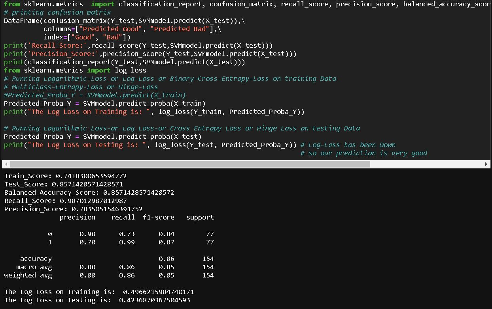
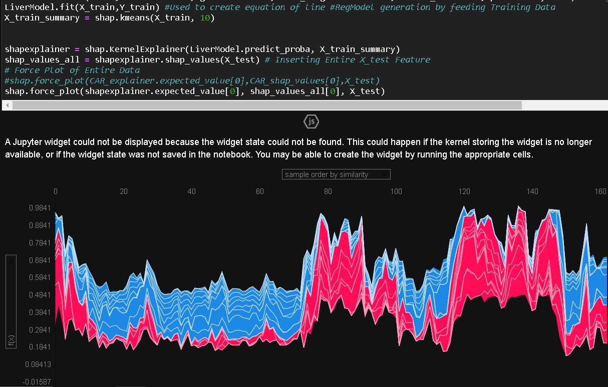
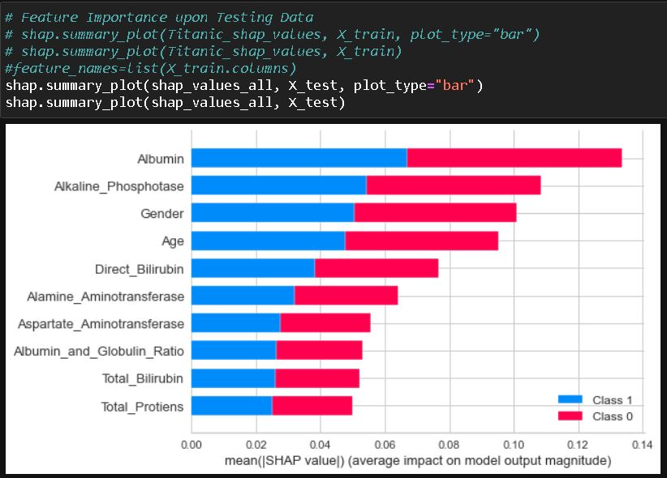
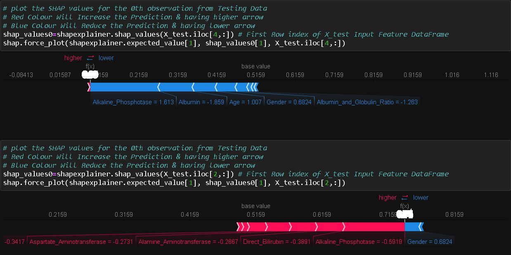
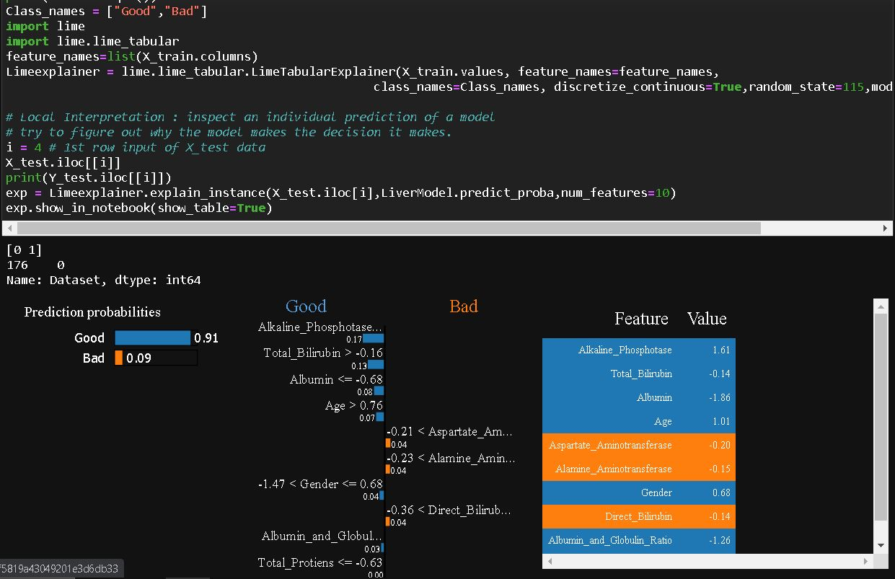
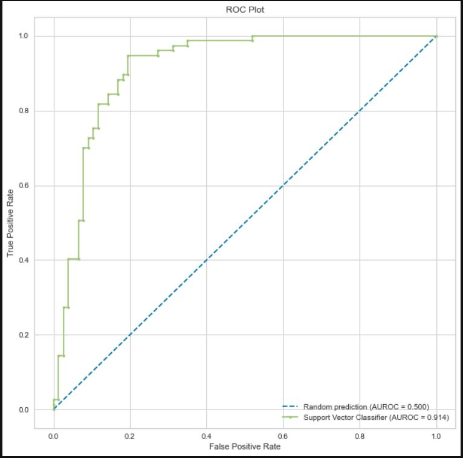

# Liver-Disease-Prediction-with-LogisticReg-KNN-KMeans-SVM-DTree-RForest-AdaBoost-GradBoost

# Liver Disease Prediction

### Project Intro/Objective
People with Liver disease are dramatically increasing due to excessive consumption of alcohol, inhale of harmful gases, intake of contaminated food, drugs, etc. This project aims to predict the onset of the disease.

### About data
The data for this project was obtained from Kaggle. This data set contains 416 liver patient records and 167 non liver patient records collected from North East of Andhra Pradesh, India. The "Dataset" column is a *class label* used to divide groups into liver disease patient or not. This data set contains 441 male patient records and 142 female patient records. Later the Data has been balanced as 383 GOOD Liver & 383 BAD Liver

### Methodologies Used:
* Data Cleaning and Data Preprocessing
* Explatory Data Analysis
* Data Visualization
* Machine Learning - Supervised Learning Algorithms
  * Decision Trees (86.36 % Accuracy)
  * KNN (80.36 % Accuracy)
  * K Nearest Neighbors
  * Logistic Regression (82.20 % Accuracy)
  * Support Vector Machines (87.66 % Accuracy)
  * Random Forest (83.11% Accuracy)
  * AdaBoost Classifier (80.98 % Accuracy)
  * GradBoost Classifier (88.95 % Accuracy)
* Evaluation Metrics
  * Jaccard Index
  * F1-Score
  * Log Loss

### Technologies utilized:
* Anaconda
* Jupyter
* Python
* Pandas
* NumPy
* Matplotlib
* Seaborn
* Sklearn

### Needs of this project:
* Data Exploration/Descriptive Statistics
* Data Preprocessing/Cleaning
* Statistical Modeling
* Machine Learning - Supervised Learning Approach
* Wrtiteup/Reporting
